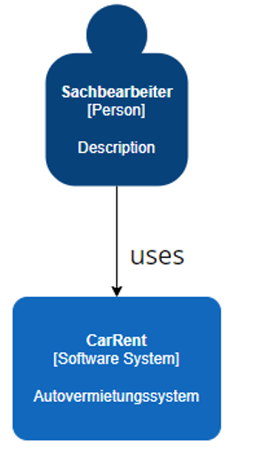
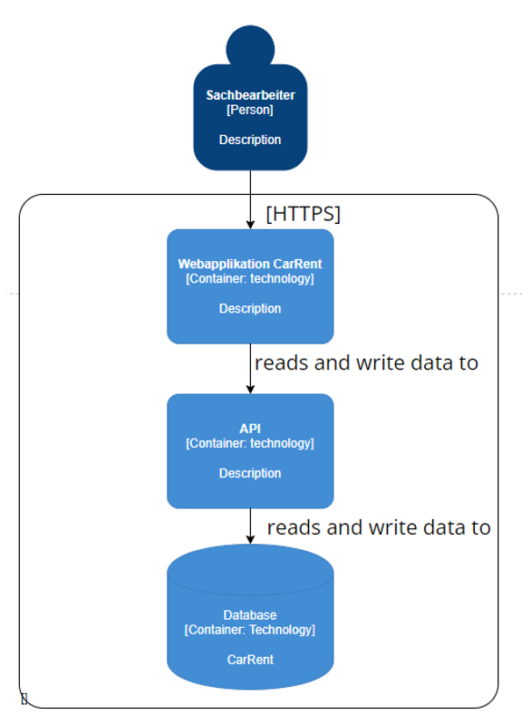
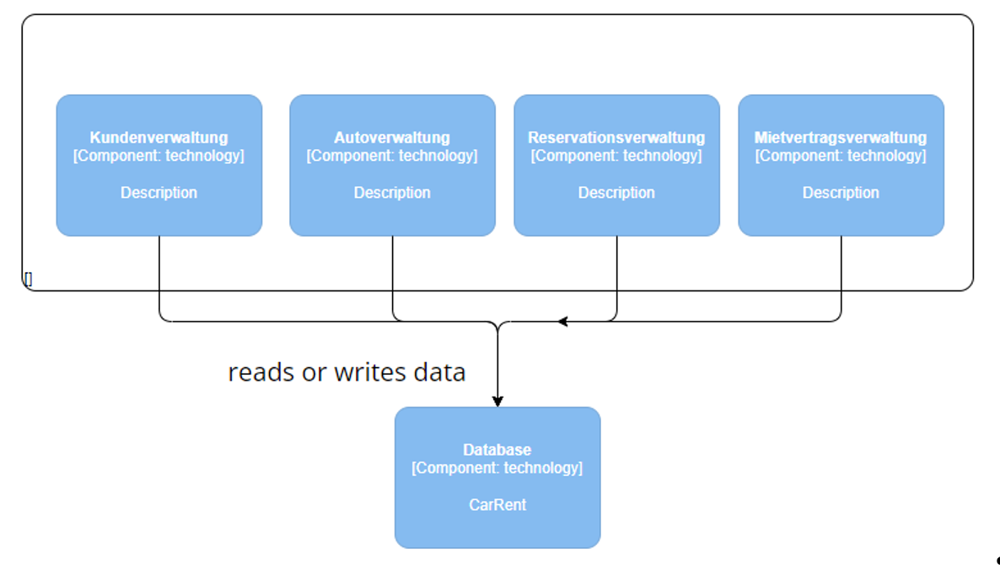
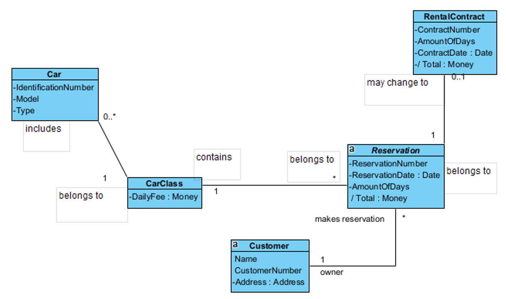
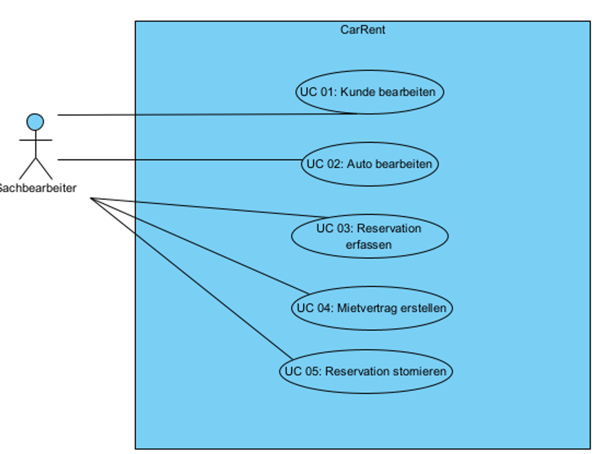
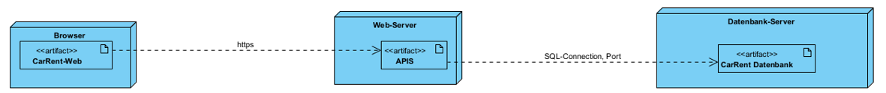
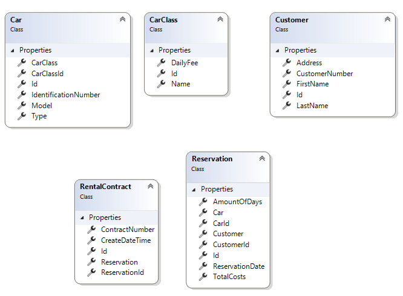

# CarRent von Patrick Nef

## Big Picture

### Context-Diagramm

Es soll ein neues Autovermeitungssystem "CarRent" erstellt werden. Von folgenden Benutzern soll das System verwendet werden können.
- Sachbearbeiter
- Kunde

Es soll in den bereits bestehenden Web-Server integriert werden. Somit wird es bei der CarRent-Software um eine Webapplikation handeln.

### Container

Da der bereits bestehende Web-Server verwendet werden soll, wird es sich bei der CarRent-Software defintiiv um eine Webapplikation handeln.
Der Sachbearbeiter verwendet die Webapplikation CarRent. Die Software lädt und bearbeitet die Daten über eine API. Die API selbst lädt die Daten aus der Datenbank oder schreibt diese auf die Datenbank.
Code muss in allen Containern geschrieben werden, wobei der Code für die Datenbank, in den API-Aufrüfen verwendet werden wird.

### Components

Das System besteht aus den in folgendem Bild sichtbaren Komponenten.

### Domain Model

### Use-Cases

Die einzelnen Use-Cases im Brief-Format:

- UC 01: Kunde bearbeiten: Der Sachbearbeiter erfasst, mutiert oder sucht nach den Kundendaten. (CRUD = create, read, update, delete)
- UC 02: Auto bearbeiten: Der Sachbearbeiter erfasst, mutiert oder sucht nach den Autodaten. (CRUD = create, read, update, delete)
- UC 03: Reservation erfassen: Der Sachbearbeiter tätigt aufgrund der Informationen des Kunden (Kategorie des Autos, Start- und Enddatum) eine Reservation. Dabei regestiert er das Reservationsdatum, den Zeitbereich sowie die Kategorie des gewünschten Autos.
- UC 04: Mietvertrag erstellen: Wenn der Kunde am besagten Tag der Autoausleihe vorbeikommt, wird vom Sachbearbeiter ein Mietvertrag erstellt und mit dem gewünschten Auto der ausgewählten Kategorie verknüpft.
- UC 05: Reservation stornieren: Wenn der Kunde am besagten Tag nicht kommt, oder bereits vorher per Telefon oder Mail absagt, storniert der Sachbearbeiter die Reservation, in dem diese entfernt wird.

### Deployment View

### Class Diagram
